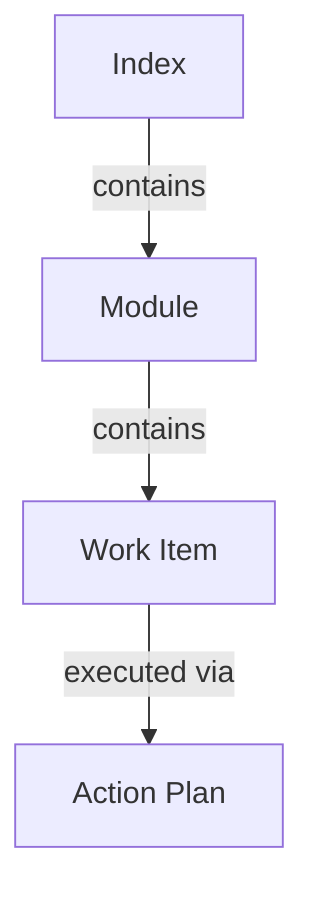

<!-- markdownlint-disable MD041 -->

[](LICENSE)
[](https://github.com/EddaCraft/anvil-plan-spec/releases/tag/v0.6.0)
[](docs/ai-agent-guide.md)

<!-- markdownlint-enable MD041 -->

# Anvil Plan Spec (APS)

> **Plan before you prompt.** A portable, markdown-native specification format that
> turns AI coding agents from improvisers into executors.

APS is the planning layer that lives in your repo, travels with your code, and
works with every AI tool you use — Claude Code, Cursor, Copilot, Codex, OpenCode,
Grok, ChatGPT, and whatever comes next.

## Install

macOS / Linux:

```bash
curl -fsSL https://raw.githubusercontent.com/EddaCraft/anvil-plan-spec/main/scaffold/install | bash
```

Windows PowerShell:

```powershell
& ([scriptblock]::Create((irm https://raw.githubusercontent.com/EddaCraft/anvil-plan-spec/main/scaffold/install.ps1)))
```

Or install with Scoop:

```powershell
scoop install https://raw.githubusercontent.com/EddaCraft/anvil-plan-spec/main/packaging/scoop/aps.json
```

In an interactive terminal, either one-liner installs the native binary and
opens the `aps init` wizard in the same run. Use `--cli` when you only want to
install the command.

The installer can also initialize a repo, bootstrap an agent, upgrade, or add a
tool integration. Use `--cli`, `--init`, `--agent`, `--upgrade`, or
`--setup <tool>` to select an explicit flow, or `--menu` for the advanced
picker.

Want to inspect the installer first, pin a version, or run non-interactively?
See [docs/installation.md](docs/installation.md).

## Why APS?

There's no shortage of AI coding tools, and each ships its own opinionated way
of handling rules, context, and specs. **Your planning artefacts get locked
into whatever tool you used yesterday.** Switch tools and you start over.

APS solves three problems at once:

| Pain                    | Without APS                                                            | With APS                                                        |
| ----------------------- | ---------------------------------------------------------------------- | --------------------------------------------------------------- |
| **Scattered specs**     | Specs live in Notion, Linear, a chat thread, or a manual PRD           | Specs live in `plans/`, versioned with your code                |
| **Tool lock-in**        | Each AI tool needs its own ruleset, context window, and re-explanation | One spec works everywhere — every agent reads the same markdown |
| **Agent drift**         | Agents wander off, invent scope, or run out of context halfway through | Work items are authorised, bounded, and dependency-aware        |
| **No decision history** | No record of why a decision was made                                   | Decisions, designs, and learnings sit beside the code           |

It's just markdown. No vendor lock-in. No daemons. No proprietary formats.

## How APS differs from related formats

APS isn't the only spec-driven workflow for AI coding. The closest neighbours:

| Format          | Best at                                           | Where APS differs                                                                                                                                   |
| --------------- | ------------------------------------------------- | --------------------------------------------------------------------------------------------------------------------------------------------------- |
| **BMAD-METHOD** | Persona-driven workflows (PM, Architect, Dev, QA) | APS has no persona agents or YAML workflow definitions — it's plain markdown that any tool reads.                                                   |
| **Spec Kit**    | Constitution + slash commands (`/speckit.*`)      | APS isn't tied to GitHub CLI or any single vendor. The same spec works in Claude, Cursor, Codex, OpenCode, or pasted into a chat window.            |
| **OpenSpec**    | Lightweight change proposals                      | APS adds module boundaries, action plans with checkpoints, and a CLI (`next`/`start`/`complete`/`graph`) that drives execution, not just tracks it. |

## The 5-minute tour

### 1. Author a plan

```markdown
# Add Dark Mode

## Problem

Users want to reduce eye strain when working at night.

## Success

- [ ] Toggle persists across sessions
- [ ] All components respect theme

## Work Items

### 001: Add theme context

- **Status:** Ready
- **Outcome:** ThemeProvider wraps app, exposes toggle
- **Validation:** `npm test -- theme.test.tsx`

### 002: Add toggle to settings

- **Status:** Ready
- **Outcome:** Settings page has working theme toggle
- **Validation:** Manual verification
- **Depends on:** 001
```

> Minimal form for illustration. Real specs use a richer schema — see the
> [templates](#templates) for the full surface.

### 2. Drive it with the CLI

```bash
aps lint plans/                       # validate every spec
aps next                              # what's the next ready work item?
aps start AUTH-003                    # claim it; writes a context package
aps complete AUTH-003 --learning "Retry on 5xx improved success rate by 18%"
aps graph auth                        # see dependencies at a glance
```

`aps start` enforces that every dependency is `Complete`, marks the item
`In Progress`, and writes a focused context package to `.aps/context/<ID>.md`
(module scope, decisions, upstream learnings, related files). `aps complete`
stamps a UTC date and captures a learning that surfaces in downstream items.

Full reference: [docs/usage.md](docs/usage.md).

### 3. Use it with any AI

```text
You have a work item authorised at plans/modules/auth.aps.md (AUTH-003).
Context package: .aps/context/AUTH-003.md.
Implement it, run the validation step, and report back.
```

That prompt works in Claude Code, Cursor, Copilot, Codex, OpenCode, Grok,
or pasted into ChatGPT. Same spec, same outcome, no integration code.

## The mental model


```mermaid
graph TD
    A[Index] -->|contains| B[Module]
    B -->|contains| C[Work Item]
    C -->|executed via| D[Action Plan]
```

| Layer           | Purpose                                      | Executable?               |
| --------------- | -------------------------------------------- | ------------------------- |
| **Index**       | High-level plan with modules and milestones  | No — describes intent     |
| **Module**      | Bounded scope with interfaces and work items | If status is Ready        |
| **Work Item**   | Single coherent change with validation       | Yes — execution authority |
| **Action Plan** | Ordered actions with checkpoints             | Yes — granular execution  |

You author top-down (Index → Module → Work Items). You execute bottom-up
(Work Item → Action Plan when needed). Action plans are optional; small items
don't need them.

## Works with your stack

| Context                    | How to use APS                                      |
| -------------------------- | --------------------------------------------------- |
| **Claude / ChatGPT**       | Paste the spec into your conversation               |
| **Cursor / Copilot**       | Keep specs in your repo, reference in prompts       |
| **Claude Code / aider**    | Point the agent at your spec files                  |
| **Codex / OpenCode**       | First-class agent definitions ship in `agents/`     |
| **Grok Build**             | Reads `AGENTS.md`, auto-discovers `.agents/skills/`  |
| **Jira / Linear / Notion** | Link to specs in git, or embed the markdown         |
| **Code review**            | Review spec changes in PRs before implementation    |
| **Team planning**          | Specs are human-readable — discuss them in meetings |

No plugins. No integrations. No configuration. It's just files.

## What's in v0.7.0

Released **2026-07-21** — making APS adoptable by a *team*, not just its author.

- **Managed skill installs** — every skill tree carries an `.aps-managed.json`
  marker, so `aps update` refreshes APS-owned content without ever clobbering
  your edits. Written and reconciled byte-for-byte by the Rust, bash, and
  PowerShell CLIs; `aps doctor` reports each root as fresh/stale/dirty.
- **v2 layout everywhere** — the curl updaters and PowerShell `aps init` now
  deliver the current `.aps/`-based layout (and migrate v1 installs with a
  backup); `cli_version` in `.aps/config.yml` is the single version stamp.
- **`aps export --json`** — a deterministic `aps-export/v1` snapshot of the
  plan tree for non-CLI stakeholders; byte-identical in Rust and bash.
- **Composite GitHub Action** — `uses: eddacraft/anvil-plan-spec@<tag>` lints
  a repo's plans in CI, with an opt-in sticky rollup PR comment.
- **Harness set** — Gemini retires, Grok Build joins (Claude Code, Copilot,
  Codex, OpenCode, Grok); fenced code blocks no longer produce phantom lint
  findings.
- **Team rollout guide + multi-owner example** — [docs/team-rollout.md](docs/team-rollout.md)
  and `examples/team-payments/` cover ownership, review, and version pinning.

Full notes: [CHANGELOG.md](CHANGELOG.md).

## Templates

| Template                                                             | Use When                                                |
| -------------------------------------------------------------------- | ------------------------------------------------------- |
| [quickstart.template.md](templates/quickstart.template.md)           | **Try APS in 5 minutes** — minimal single-file format   |
| [index.template.md](templates/index.template.md)                     | Starting a new plan or initiative                       |
| [index-expanded.template.md](templates/index-expanded.template.md)   | Larger initiatives with 6+ modules or rich metadata     |
| [index-monorepo.template.md](templates/index-monorepo.template.md)   | Monorepos with multiple packages or apps                |
| [module.template.md](templates/module.template.md)                   | Defining a bounded module with work items               |
| [simple.template.md](templates/simple.template.md)                   | Small, self-contained features                          |
| [actions.template.md](templates/actions.template.md)                 | Breaking work items into executable actions             |
| [issues.template.md](templates/issues.template.md)                   | Tracking dev-time discoveries (ISS-NNN / Q-NNN)         |
| [design.template.md](templates/design.template.md)                   | Technical/architectural design for complex work         |
| [solution.template.md](templates/solution.template.md)               | Documenting solved problems (compound phase)            |
| [completed-index.template.md](templates/completed-index.template.md) | Rolling shipped work into a historical index            |
| [release.template.md](templates/release.template.md)                 | Telling the story of a release (theme, criteria, risks) |

## Worked examples

- [User Authentication](examples/user-auth/) — Adding auth to an existing app
- [OpenCode Companion App](examples/opencode-companion/) — Building a companion tool

## Project structure

```text
your-project/
├── plans/
│   ├── aps-rules.md              # AI agent guidance (portable, ships with APS)
│   ├── project-context.md        # Project-specific context (you own this)
│   ├── index.aps.md              # Main plan (roadmap + module index)
│   ├── issues.md                 # Dev-time discoveries (ISS-NNN / Q-NNN)
│   ├── modules/                  # Module specs — one .aps.md per bounded area
│   │   ├── auth.aps.md
│   │   └── payments.aps.md
│   ├── execution/                # Action plans for complex work items
│   │   └── AUTH-001.actions.md
│   ├── designs/                  # Technical designs (optional)
│   │   └── 2026-01-05-auth.design.md
│   └── decisions/                # ADRs (optional)
│       └── 001-use-jwt.md
└── .aps/
    └── context/                  # Ephemeral context packages from `aps start`
        └── AUTH-001.md           # Gitignored — regenerated on each start
```

## Platform support

| Platform    | Recommended path                                  | Notes                                      |
| ----------- | ------------------------------------------------- | ------------------------------------------ |
| **Linux**   | Native `aps` binary via install script or cargo   | Bash CLI fallback needs Bash 4.0+          |
| **macOS**   | Native `aps` binary via install script or cargo   | Bash fallback needs Homebrew Bash 4.0+     |
| **Windows** | Native `aps.exe` via PowerShell script or Scoop   | Full user command surface in PowerShell    |

The native binary supports the complete user command surface on every listed
platform. Windows users do not need WSL or Git Bash; those shells remain
optional for agent and contributor automation. macOS ships Bash 3.2 (too old
for the fallback runtime); Homebrew's bash is picked up automatically.

## AI agent guidance

`aps init` scaffolds `plans/aps-rules.md` into your project — a portable guide
that travels with your specs. Point your agent at it and APS conventions are
followed by default.

- [AI Agent Implementation Guide](docs/ai-agent-guide.md) — Full guide for LLMs
- [Agent definitions](docs/agents.md) — Claude Code, Codex, Copilot, OpenCode, Grok
- [Prompts](docs/ai/prompting/) — Tool-agnostic prompts
- [AGENTS.md](AGENTS.md) — Collaboration rules for this repo

## Philosophy: compound engineering

APS embraces the principle that every unit of engineering work should make the
next one easier — not harder. Traditional development accumulates debt;
compound engineering inverts this by front-loading planning and review, so
execution is fast and clean.

```text
Plan → Execute → Validate → Learn → Plan again
  ↑                                          │
  └──────────────────────────────────────────┘
```

**The 80/20 split:** 80% planning and review, 20% execution. The cycle exists
to make each plan better than the last. See [docs/workflow.md](docs/workflow.md)
for the full lifecycle.

## Principles

1. **Specs describe intent** — what and why, not how
2. **Work items authorise execution** — no work item, no implementation
3. **Humans remain accountable** — AI proposes, humans approve
4. **Checkpoints are observable** — every action has a verifiable state

## Learn more

- [Getting started](docs/getting-started.md) — first plan, end-to-end
- [Team rollout](docs/team-rollout.md) — ownership, plan-change review, version pinning, CI enforcement
- [Integrations](docs/integrations.md) — GitHub Action, `aps export --json`
- [Workflow guide](docs/workflow.md) — Plan / Execute / Validate / Learn
- [CLI reference](docs/usage.md) — every command, every flag, JSON output
- [Release planning](docs/release-planning.md) — release narratives, status flow, tooling hand-off
- [Conductor modules](docs/conductor-modules.md) — crosscutting modules that coordinate work across domains
- [Monorepo support](docs/monorepo.md) — multi-package layouts
- [Terminology](docs/TERMINOLOGY.md) — words APS uses and what they mean
- [Roadmap](ROADMAP.md) — where this is going
- [Contributing](CONTRIBUTING.md) — open a PR

## License

Apache-2.0. See [LICENSE](LICENSE).
