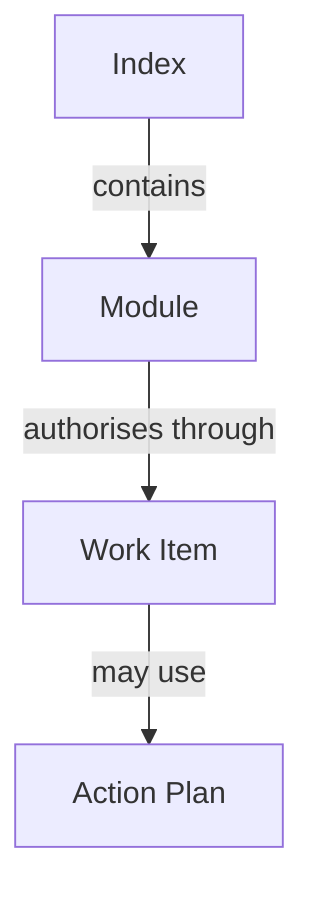

<!-- markdownlint-disable MD041 -->

[](LICENSE)
[](https://github.com/EddaCraft/anvil-plan-spec/releases/tag/v0.7.0)
[](docs/ai-agent-guide.md)

<!-- markdownlint-enable MD041 -->

# Anvil Plan Spec (APS)

> **Plan the outcome. Authorise the work. Let the implementation adapt.**

APS is an open, markdown-native planning specification for AI-assisted
engineering. It gives people and agents a shared contract for what must be
true, without prematurely prescribing how the code must be written.

The central idea is simple:

- **Specifications define intent.** They capture the problem, success,
  boundaries, constraints, risks, and decisions.
- **Work items authorise execution.** They turn part of that intent into a
  bounded change with an observable outcome and validation.
- **Implementation remains adaptive.** The agent uses the current codebase,
  its patterns, and its tools to choose the best way to satisfy the contract.

They may live together in markdown, but they are not the same thing. A plan is
not a backlog, and a work item is not a miniature implementation guide.

That separation is what makes APS useful. Humans can review and approve intent
before code changes. Agents get clear authority without being trapped by stale
instructions. The same plan survives changes in model, harness, team, and
implementation detail.

## Most AI planning collapses three decisions into one

A typical ticket or prompt mixes together:

1. why the change matters;
2. what outcome is required; and
3. how someone currently imagines it should be implemented.

That creates a bad trade-off. Give an agent detailed steps and it may follow a
stale recipe instead of the codebase. Give it only a loose goal and it may
invent scope, miss constraints, or declare success without proof.

APS separates those concerns into explicit contracts:

| Layer | Decides | Contains | Deliberately avoids | Authority |
| --- | --- | --- | --- | --- |
| **Index** | Why the initiative exists | Problem, success criteria, modules, milestones, risks | Implementation detail | None |
| **Module** | What belongs together | Purpose, scope, interfaces, constraints, decisions | Code-level instructions | None until work is authorised |
| **Work Item** | What change may now be made | Intent, expected outcome, validation, dependencies, non-scope | Libraries, algorithms, and file-by-file recipes | Bounded execution authority |
| **Action Plan** | How complex work is coordinated | Actions, waves, produced artefacts, checkpoints | Tutorials and speculative code structure | Optional execution breakdown |

In practical terms:

- the **specification** answers, “Are we solving the right problem?”;
- the **work item** answers, “What is the agent authorised to change, and what
  must be true when it finishes?”; and
- the **implementation** answers, “What is the best way to achieve that in the
  codebase as it exists now?”

APS stabilises the first two while allowing the third to evolve.

## Intent-focused planning, not implementation theatre

This looks like a plan, but it is mostly an untested implementation guess:

```markdown
### Add dark mode

1. Install a theme package
2. Create ThemeProvider in app/providers.tsx
3. Store the selected value in localStorage
4. Add a toggle to Settings
```

It tells an agent where to type before establishing what success means. It
also becomes wrong as soon as the architecture, dependency policy, or file
layout changes.

An APS work item keeps the intent stable and makes completion provable:

```markdown
### THEME-001: Add persistent theme selection

- **Intent:** Let users choose a comfortable theme for the application
- **Expected Outcome:** Users can select light, dark, or system appearance;
  the choice persists across sessions; every supported component respects it
- **Validation:** `npm test -- theme && npm run test:e2e -- settings-theme`
- **Non-scope:** Redesigning component styles or adding new colour palettes
```

The agent is free to inspect the repository and choose an existing theme
primitive, native browser capability, or appropriate dependency. It cannot
quietly redefine the outcome, expand the scope, or skip validation.

**APS does not replace agent intelligence. It gives that intelligence a stable
target.**

## What this changes

| Without APS | With APS |
| --- | --- |
| A chat transcript becomes the plan | The plan lives in `plans/`, versioned with the code |
| The ticket mixes intent and a guessed solution | Intent, authority, and implementation are distinct |
| Every new agent needs the project re-explained | Every agent reads the same durable contract |
| Agents infer whether they are allowed to change something | A Ready work item grants explicit, bounded authority |
| “Done” means the agent stopped | Completion requires an observable outcome and validation |
| Decisions and discoveries disappear into conversation history | Decisions, results, and learnings compound in the repository |
| Switching tools means starting again | Plain markdown works across models and harnesses |

APS is not a project management system disguised as markdown. It is the
planning and authorisation layer between human intent and agent execution.

## The 5-minute tour

### 1. Define the intent

```markdown
# Account security

## Problem

Users cannot see or terminate active sessions, leaving compromised sessions
active until they expire.

## Success Criteria

- [ ] Users can see their active sessions
- [ ] Users can revoke any session except the one making the request
- [ ] Revoked sessions stop working immediately

## Constraints

- Existing clients must remain compatible
- Session identifiers must never be exposed in logs
```

This is a specification. It can be reviewed, challenged, or approved, but it
does not authorise an agent to start changing code.

### 2. Authorise a bounded outcome

```markdown
### AUTH-003: Revoke an active session

- **Status:** Ready
- **Intent:** Let an authenticated user terminate an unwanted session
- **Expected Outcome:** Revoking a listed session invalidates it immediately
  while leaving the current session active
- **Validation:** `npm test -- session-revocation`
- **Non-scope:** Changing session duration or authentication providers
- **Dependencies:** AUTH-002
```

The Ready work item is execution authority. It describes what must be achieved,
how success is checked, and where the boundary sits. It does not dictate the
implementation.

### 3. Execute through the CLI

```bash
aps lint plans/                       # validate every spec
aps next                              # find the next ready work item
aps start AUTH-003                    # claim it and build focused context
aps complete AUTH-003 --learning "Revocation needed cache invalidation"
aps graph auth                        # inspect dependencies
```

`aps start` verifies that dependencies are Complete, marks the item In
Progress, and writes a focused context package to `.aps/context/AUTH-003.md`.
It includes module scope, decisions, upstream learnings, and related files.

`aps complete` records the completion date and captures a learning that can be
surfaced to downstream work. The implementation can change; the intent,
evidence, and history remain legible.

Full reference: [docs/usage.md](docs/usage.md).

### 4. Use the same contract with any AI

```text
Implement the Ready work item AUTH-003 in plans/modules/auth.aps.md.
Use .aps/context/AUTH-003.md for its bounded context.
Choose an implementation consistent with the repository, run the specified
validation, and report the evidence.
```

That instruction works in Claude Code, Cursor, Copilot, Codex, OpenCode, Grok,
or a chat window. The harness can change without changing the plan.

## Install

macOS / Linux:

```bash
curl -fsSL https://raw.githubusercontent.com/EddaCraft/anvil-plan-spec/main/scaffold/install | bash
```

Windows PowerShell:

```powershell
& ([scriptblock]::Create((irm https://raw.githubusercontent.com/EddaCraft/anvil-plan-spec/main/scaffold/install.ps1)))
```

Or install with Scoop:

```powershell
scoop bucket add eddacraft https://github.com/eddacraft/scoop-bucket
scoop install eddacraft/aps
```

To install the manifest directly without adding the bucket:

```powershell
scoop install https://raw.githubusercontent.com/EddaCraft/anvil-plan-spec/main/packaging/scoop/aps.json
```

In an interactive terminal, the one-line installers install the native binary
and open the `aps init` wizard in the same run. Use `--cli` when you only want
the command.

The installer can also initialise a repository, bootstrap an agent, upgrade,
or add a tool integration. Use `--cli`, `--init`, `--agent`, `--upgrade`, or
`--setup <tool>` to select an explicit flow, or `--menu` for the advanced
picker.

Want to inspect the installer first, pin a version, or run non-interactively?
See [docs/installation.md](docs/installation.md).

## How APS differs from related formats

APS is not the only spec-driven workflow for AI coding. Its closest
neighbours solve different parts of the problem:

| Format | Best at | Where APS differs |
| --- | --- | --- |
| **BMAD-METHOD** | Persona-driven workflows for PM, architecture, development, and QA | APS has no required persona agents or YAML workflow engine. Its durable contract is plain markdown. |
| **Spec Kit** | Constitution-led development with a command workflow | APS is harness-independent and makes execution authority explicit through bounded work items. |
| **OpenSpec** | Lightweight change proposals | APS connects intent to dependency-aware work items, optional action plans, validation, and captured learnings. |

## The APS hierarchy


```mermaid
graph TD
    A[Index] -->|contains| B[Module]
    B -->|authorises through| C[Work Item]
    C -->|may use| D[Action Plan]
```

You plan top-down from intent to bounded outcomes. You execute bottom-up from
a Ready work item. Action plans are optional; most small work items do not
need one.

## Works with your stack

| Context | How to use APS |
| --- | --- |
| **Claude / ChatGPT** | Paste or attach the relevant specification and work item |
| **Cursor / Copilot** | Keep plans in the repository and reference the work item |
| **Claude Code / aider** | Point the agent at the plan and context package |
| **Codex / OpenCode** | Use the agent definitions shipped in `agents/` |
| **Grok Build** | Let it discover `AGENTS.md` and `.agents/skills/` |
| **Antigravity** | Let it discover `AGENTS.md` and `.agents/skills/` |
| **Jira / Linear / Notion** | Track delivery there while linking to durable APS intent |
| **Code review** | Review plan authority and implementation evidence together |
| **Team planning** | Discuss the same human-readable contract agents execute |

APS needs no hosted service, proprietary format, or mandatory integration.

## What's in v0.7.0

Released **2026-07-21**, this release makes APS adoptable by a team, not only
its original author.

- **Managed skill installs:** every skill tree carries an `.aps-managed.json`
  marker, so `aps update` refreshes APS-owned content without overwriting user
  edits. The Rust, bash, and PowerShell CLIs reconcile it byte-for-byte.
- **v2 layout everywhere:** installers and updaters deliver the current
  `.aps/` layout, migrate v1 installations with a backup, and use `cli_version`
  in `.aps/config.yml` as the single version stamp.
- **`aps export --json`:** a deterministic `aps-export/v1` snapshot gives
  non-CLI stakeholders and other tools a stable view of the plan tree.
- **Composite GitHub Action:** `uses: eddacraft/anvil-plan-spec@<tag>` lints
  plans in CI, with an optional sticky pull request roll-up comment.
- **Expanded harness set:** Claude Code, Copilot, Codex, OpenCode, Grok, and
  Antigravity consume the same planning contract.
- **Team rollout guidance:** [docs/team-rollout.md](docs/team-rollout.md) and
  `examples/team-payments/` cover ownership, review, and version pinning.

Full notes: [CHANGELOG.md](CHANGELOG.md).

## Templates

| Template | Use when |
| --- | --- |
| [quickstart.template.md](templates/quickstart.template.md) | Trying APS in five minutes with a minimal single-file format |
| [index.template.md](templates/index.template.md) | Starting a new plan or initiative |
| [index-expanded.template.md](templates/index-expanded.template.md) | Planning a larger initiative with rich metadata |
| [index-monorepo.template.md](templates/index-monorepo.template.md) | Coordinating multiple packages or applications |
| [module.template.md](templates/module.template.md) | Defining a bounded module and its work items |
| [simple.template.md](templates/simple.template.md) | Planning a small, self-contained feature |
| [actions.template.md](templates/actions.template.md) | Coordinating a complex work item through actions and checkpoints |
| [issues.template.md](templates/issues.template.md) | Tracking discoveries and open questions |
| [design.template.md](templates/design.template.md) | Resolving a technical or architectural choice |
| [solution.template.md](templates/solution.template.md) | Preserving a solved problem for later work |
| [completed-index.template.md](templates/completed-index.template.md) | Rolling shipped work into a historical index |
| [release.template.md](templates/release.template.md) | Telling the story of a release |

## Worked examples

- [User Authentication](examples/user-auth/): adding authentication to an
  existing application
- [OpenCode Companion App](examples/opencode-companion/): building a companion
  tool
- [Team Payments](examples/team-payments/): coordinating multiple owners

## Project structure

```text
your-project/
├── plans/
│   ├── aps-rules.md              # Portable guidance managed by APS
│   ├── project-context.md        # Project context owned by your team
│   ├── index.aps.md              # Initiative intent and module index
│   ├── issues.md                 # Discoveries and open questions
│   ├── modules/
│   │   ├── auth.aps.md           # Bounded intent plus authorised work items
│   │   └── payments.aps.md
│   ├── execution/
│   │   └── AUTH-001.actions.md   # Optional coordination for complex work
│   ├── designs/
│   │   └── 2026-01-05-auth.design.md
│   └── decisions/
│       └── 001-use-sessions.md
└── .aps/
    └── context/
        └── AUTH-001.md           # Ephemeral focused context from aps start
```

## Platform support

| Platform | Recommended path | Notes |
| --- | --- | --- |
| **Linux** | Native `aps` binary through the install script or Cargo | Bash fallback needs Bash 4.0+ |
| **macOS** | Native `aps` binary through the install script or Cargo | Homebrew Bash is used for the optional fallback |
| **Windows** | Native `aps.exe` through PowerShell or Scoop | WSL and Git Bash are not required |

The native binary supports the complete user command surface on all listed
platforms.

## AI agent guidance

`aps init` scaffolds `plans/aps-rules.md` into your project. This portable guide
travels with the plan and teaches each agent the same planning, authority, and
validation conventions.

- [AI Agent Implementation Guide](docs/ai-agent-guide.md)
- [Agent definitions](docs/agents.md)
- [Tool-agnostic prompts](docs/ai/prompting/)
- [Collaboration rules for this repository](AGENTS.md)

## Compound engineering

APS treats planning as a learning loop rather than a one-off document:

```text
Plan → Authorise → Execute → Validate → Learn
  ↑                                      │
  └──────────────────────────────────────┘
```

The result of one work item improves the context for the next. Decisions remain
visible, validation keeps the plan honest, and captured learnings reduce repeat
discovery.

See [docs/workflow.md](docs/workflow.md) for the full lifecycle.

## Principles

1. **Specifications describe intent:** capture what matters and why.
2. **Work items authorise execution:** no work item means no implied permission
   to implement.
3. **Outcomes outrank recipes:** preserve constraints and proof, not speculative
   implementation detail.
4. **Implementation stays adaptive:** use the codebase and current evidence to
   choose how.
5. **Humans remain accountable:** AI can propose and execute; people approve
   intent and authority.
6. **Validation closes the loop:** completion requires observable evidence.
7. **Learning compounds:** each completed item should make future work easier.

## Learn more

- [Getting started](docs/getting-started.md)
- [Team rollout](docs/team-rollout.md)
- [Integrations](docs/integrations.md)
- [Workflow guide](docs/workflow.md)
- [CLI reference](docs/usage.md)
- [Release planning](docs/release-planning.md)
- [Conductor modules](docs/conductor-modules.md)
- [Monorepo support](docs/monorepo.md)
- [Terminology](docs/TERMINOLOGY.md)
- [Roadmap](ROADMAP.md)
- [Contributing](CONTRIBUTING.md)

## License

Apache-2.0. See [LICENSE](LICENSE).
