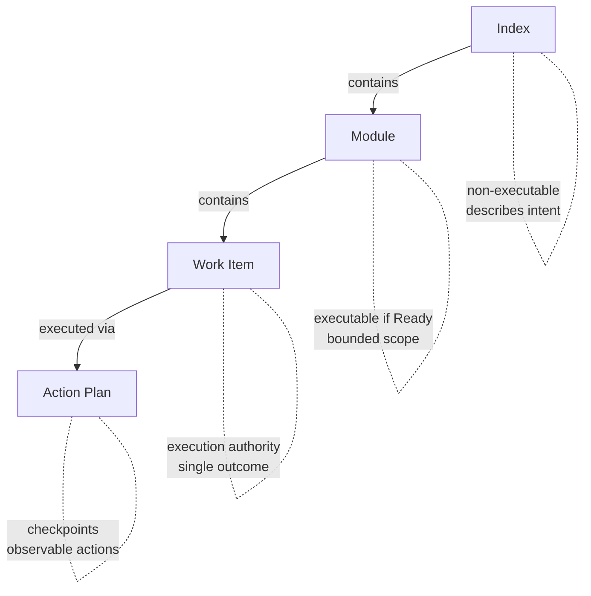

<!-- markdownlint-disable MD041 -->

[](LICENSE)
[](https://github.com/EddaCraft/anvil-plan-spec/releases/tag/v0.2.0)

<!-- markdownlint-enable MD041 -->

# Anvil Plan Spec (APS)

A lightweight specification format for planning and work item authorisation in
AI-assisted development.

## Quick Start

```bash
curl -fsSL https://raw.githubusercontent.com/EddaCraft/anvil-plan-spec/main/scaffold/install | bash
```

See [docs/installation.md](docs/installation.md) for Windows, version pinning, and manual setup options.

## What is APS?

APS provides a structured way to:

- **Plan work** before implementation begins
- **Authorise work items** that AI agents can execute
- **Track execution** through observable checkpoints

It acts as a trust layer between humans and AI — humans remain accountable
for decisions while AI assists with planning and implementation.

## Why APS?

There's no shortage of AI coding tools — Cursor, Kiro, Claude Code, Copilot,
and countless agent frameworks. Each has its own way of handling context,
rules, and specifications. **The problem: your planning artefacts get locked
into whatever tool you're using today.**

APS is different:

- **Portable** — Plain markdown files. No vendor lock-in. Switch tools anytime.
- **Versioned** — Lives in git. Review plans in PRs. Track changes over time.
- **Tool-agnostic** — Works with any AI, any IDE, any workflow.
- **Human-readable** — Your PM, tech lead, and future self can all understand it.

APS isn't a replacement for your AI tools — it's the planning layer that works
_across_ all of them. Write your spec once, use it everywhere.

## Hierarchy


```mermaid
graph TD
    A[Index] -->|contains| B[Module]
    B -->|contains| C[Work Item]
    C -->|executed via| D[Action Plan]

    A -.-|"non-executable<br/>describes intent"| A
    B -.-|"executable if Ready<br/>bounded scope"| B
    C -.-|"execution authority<br/>single outcome"| C
    D -.-|"checkpoints<br/>observable actions"| D
```

| Layer           | Purpose                                      | Executable?               |
| --------------- | -------------------------------------------- | ------------------------- |
| **Index**       | High-level plan with modules and milestones  | No                        |
| **Module**      | Bounded scope with interfaces and work items | If status is Ready        |
| **Work Item**   | Single coherent change with validation       | Yes — execution authority |
| **Action Plan** | Ordered actions with checkpoints             | Yes — granular execution  |

**Key concepts:**

- **Index** — The root plan. Describes the whole initiative, lists modules.
- **Module** — A bounded area where work happens. The smallest unit you _plan_.
  You don't subdivide modules into sub-plans — they contain work items directly.
- **Work Item** — A single authorised change. The unit of execution authority.
- **Action Plan** — How you _execute_ a work item. Optional, generated when needed. Breaks
  a work item into checkpointed actions for granular progress tracking.

## Hello World

```markdown
# Add Dark Mode

## Problem

Users want to reduce eye strain when working at night.

## Success

- [ ] Toggle persists across sessions
- [ ] All components respect theme

## Work Items

### 001: Add theme context

- **Outcome:** ThemeProvider wraps app, exposes toggle
- **Test:** `npm test -- theme.test.tsx`

### 002: Add toggle to settings

- **Outcome:** Settings page has working theme toggle
- **Test:** Manual verification
- **Depends on:** 001
```

## Driving a Plan

Once you have a plan, the `aps` CLI drives it through the work-item lifecycle.
Markdown stays the source of truth — the CLI just reads and rewrites it.

```bash
aps lint plans/                       # Validate every spec
aps next                              # Find the next ready work item
aps start AUTH-003                    # Mark it In Progress, get a context package
# ...implement, test...
aps complete AUTH-003 --learning "Retry on 5xx"
aps graph auth                        # See dependencies at a glance
```

`aps start` validates that all dependencies are `Complete` and writes a
focused context package to `.aps/context/<ID>.md` (module scope, decisions,
upstream learnings). `aps complete` requires the item to be `In Progress` and
stamps a UTC completion date.

See [docs/usage.md](docs/usage.md) for the full command reference, state
machine, error codes, JSON output, and CI integration.

## Works Everywhere

APS is just markdown. Use it however you work:

| Context                    | How to use APS                                      |
| -------------------------- | --------------------------------------------------- |
| **Claude / ChatGPT**       | Paste the spec into your conversation               |
| **Cursor / Copilot**       | Keep specs in your repo, reference in prompts       |
| **Claude Code / aider**    | Point the agent at your spec files                  |
| **Jira / Linear / Notion** | Link to specs in git, or embed the markdown         |
| **Code review**            | Review spec changes in PRs before implementation    |
| **Team planning**          | Specs are human-readable — discuss them in meetings |

No plugins. No integrations. No configuration. It's just files.

## Templates

| Template                                                           | Use When                                              |
| ------------------------------------------------------------------ | ----------------------------------------------------- |
| [quickstart.template.md](templates/quickstart.template.md)         | **Try APS in 5 minutes** — minimal single-file format |
| [index.template.md](templates/index.template.md)                   | Starting a new plan or initiative                     |
| [index-expanded.template.md](templates/index-expanded.template.md) | Larger initiatives with 6+ modules or rich metadata   |
| [module.template.md](templates/module.template.md)                 | Defining a bounded module with work items             |
| [simple.template.md](templates/simple.template.md)                 | Small, self-contained features                        |
| [actions.template.md](templates/actions.template.md)               | Breaking work items into executable actions           |
| [design.template.md](templates/design.template.md)                 | Technical/architectural design for complex work       |
| [solution.template.md](templates/solution.template.md)             | Documenting solved problems (compound phase)          |

## Examples

- [User Authentication](examples/user-auth/) — Adding auth to an existing app
- [OpenCode Companion App](examples/opencode-companion/) — Building a companion tool

## Platform Support

| Platform    | Authoring (lint/init)              | Orchestration (next/start/complete/graph) |
| ----------- | ---------------------------------- | ----------------------------------------- |
| **Linux**   | Bash 4.0+                          | Bash 4.0+                                 |
| **macOS**   | Bash 4.0+ via `brew install bash`  | Bash 4.0+ via `brew install bash`         |
| **Windows** | PowerShell 5.1+ (native `aps.ps1`) | Bash 4.0+ via WSL or Git Bash             |

The bash CLI uses `#!/usr/bin/env bash`, so Homebrew's bash is picked up
automatically once it's on your `PATH`. macOS ships Bash 3.2 (2007), which is
too old — APS needs associative arrays.

A native PowerShell port of the orchestration commands is on the roadmap.
Until then, Windows users on WSL or Git Bash get the full experience.

## AI Guidance

APS includes `aps-rules.md` — a portable guide that travels with your specs.
Point your AI agent at this file and it will follow APS conventions.

- [AI Agent Implementation Guide](docs/ai-agent-guide.md) — Full guide for LLMs
- [Prompts](docs/ai/prompting/) — Tool-agnostic prompts
- [AGENTS.md](AGENTS.md) — Collaboration rules for this repo

## Philosophy: Compound Engineering

APS embraces the principle of **compound engineering**: each unit of engineering
work should make subsequent units easier—not harder.

Traditional development accumulates technical debt. Every feature adds complexity.
The codebase becomes harder to work with over time. Compound engineering inverts
this by investing heavily in planning and review upfront, so execution is fast
and clean.

**The 80/20 split:**

- **80% planning and review** — Thorough specs, clear work items, validated
  checkpoints
- **20% execution** — Fast implementation following well-defined plans

**The planning lifecycle:**

```
Plan → Execute → Validate → Learn → Plan again
  ↑                                      │
  └──────────────────────────────────────┘
```

| Phase        | What Happens                               | How It Serves Planning                 |
| ------------ | ------------------------------------------ | -------------------------------------- |
| **Plan**     | Define scope, success criteria, work items | Reference past patterns and solutions  |
| **Execute**  | Work against well-defined specs            | Clean implementation, fewer blockers   |
| **Validate** | Check outcomes against spec                | Verify plan was correct, update if not |
| **Learn**    | Document solutions and learnings           | Future plans start with known answers  |

Planning without validation is guesswork. Validation without learning repeats
mistakes. The cycle exists to make each plan better than the last.

See [docs/workflow.md](docs/workflow.md) for the full workflow guide.

## Principles

1. **Specs describe intent** — what and why, not how
2. **Work items authorise execution** — no work item, no implementation
3. **Humans remain accountable** — AI proposes, humans approve
4. **Checkpoints are observable** — every action has a verifiable state

## Project Structure

```text
your-project/
├── plans/
│   ├── aps-rules.md              # AI agent guidance (portable, ships with APS)
│   ├── project-context.md        # Project-specific context (you own this)
│   ├── index.aps.md              # Main plan (roadmap + module index)
│   ├── issues.md                 # Dev-time discoveries (ISS-NNN / Q-NNN)
│   ├── modules/                  # Module specs — one .aps.md per bounded area
│   │   ├── auth.aps.md
│   │   └── payments.aps.md
│   ├── execution/                # Action plans for complex work items
│   │   └── AUTH-001.actions.md
│   ├── designs/                  # Technical designs (optional)
│   │   └── 2026-01-05-auth.design.md
│   └── decisions/                # ADRs (optional)
│       └── 001-use-jwt.md
└── .aps/
    └── context/                  # Ephemeral context packages from `aps start`
        └── AUTH-001.md           # Gitignored — regenerated on each start
```

## Versioning

The current release is **v0.2.0**. See [CHANGELOG.md](CHANGELOG.md) for what's
included and [Releases](https://github.com/EddaCraft/anvil-plan-spec/releases)
for downloads.

To install a specific version:

```bash
curl -fsSL https://raw.githubusercontent.com/EddaCraft/anvil-plan-spec/main/scaffold/install | VERSION=v0.2.0 bash
```

## Roadmap

See [ROADMAP.md](ROADMAP.md) for planned features and direction.

## Contributing

See [CONTRIBUTING.md](CONTRIBUTING.md).

## License

Apache-2.0. See [LICENSE](LICENSE).
