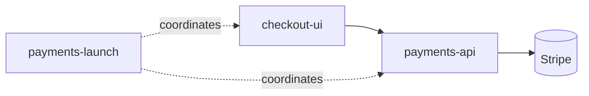

<!-- APS: See docs/ai/prompting/ for AI guidance -->
<!-- This document is non-executable. -->

# Team Payments

## Overview

Add card payments to the storefront. This example shows a **team-shaped plan
mid-execution** (see [docs/team-rollout.md](../../docs/team-rollout.md)):
three modules with three different owners, a conductor for the cross-module
launch work, and honest in-flight statuses — not a finished artifact.

## Problem & Success Criteria

**Problem:** The storefront only supports invoicing. Customers abandon
checkout because they can't pay by card, and finance reconciles by hand.

**Success Criteria:**

- [ ] Customers can pay by card at checkout
- [x] Provider selected and sandbox account provisioned
- [ ] Failed payments surface a retryable error, never a silent drop
- [ ] Finance sees settled payments in the daily export

## Constraints

- PCI scope stays SAQ-A: card data never touches our servers (hosted fields)
- Provider is Stripe (D-001); no multi-provider abstraction in v1
- One plan index; module owners own their module files (team convention)

## System Map

## Modules

| Module                                                | ID   | Owner  | Status      | Priority | Tags          | Dependencies |
| ----------------------------------------------------- | ---- | ------ | ----------- | -------- | ------------- | ------------ |
| [payments-api](./modules/payments-api.aps.md)         | PAY  | @priya | In Progress | high     | backend       | —            |
| [checkout-ui](./modules/checkout-ui.aps.md)           | CKUI | @marco | Ready       | high     | frontend      | payments-api |

### Conductor / Crosscutting

| Module                                                | ID     | Owner | Status      | Priority | Tags   | Dependencies |
| ----------------------------------------------------- | ------ | ----- | ----------- | -------- | ------ | ------------ |
| [payments-launch](./modules/payments-launch.aps.md)   | LAUNCH | @sam  | In Progress | medium   | launch | —            |

## Risks & Mitigations

| Risk                          | Impact | Likelihood | Mitigation                                  |
| ----------------------------- | ------ | ---------- | ------------------------------------------- |
| Webhook delivery gaps         | high   | medium     | Reconciliation job + idempotent handlers    |
| Two owners edit one plan file | low    | medium     | One status change per PR; owners own files  |

## Decisions

- **D-001:** Stripe as the payment provider — _decided: hosted fields keep
  PCI scope at SAQ-A; team has prior Stripe experience_
- **D-002:** Plan changes ride the same PR as the code they authorise —
  _decided: a work item's status flip and its implementation land together;
  structural plan changes (new modules, decisions) get their own PR_

## Open Questions

- [ ] Do refunds land in v1 or fast-follow? (@sam to decide by launch review)
