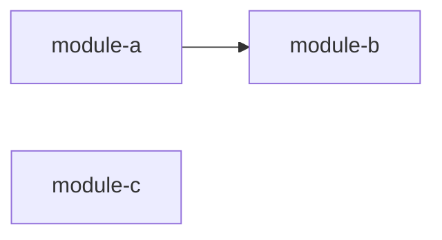

<!-- APS: See docs/ai/prompting/ for AI guidance -->
<!-- This document is non-executable. -->
<!-- For larger projects with rich metadata, see index-expanded.template.md -->

# [Plan Title]

## Overview

[One paragraph describing what this plan covers and why it matters]

## Problem & Success Criteria

**Problem:** [What problem are we solving? Why does this work matter?]

**Success Criteria:**

- [ ] [Measurable outcome 1]
- [ ] [Measurable outcome 2]
- [ ] [How we know we're done]

## Constraints

- [Technical constraint, e.g., "Must run on Node 18+"]
- [Product constraint, e.g., "Must not break existing API"]

## System Map

```mermaid
graph LR
    A[module-a] --> B[module-b]
    C[module-c]
```

## Milestones

### M1: [Milestone Name]

- **Target:** [date or scope]
- **Includes:** [modules/features]

### M2: [Milestone Name]

- **Target:** [date or scope]
- **Includes:** [modules/features]

## Modules

| Module                                    | ID  | Owner     | Status | Priority | Tags | Dependencies |
| ----------------------------------------- | --- | --------- | ------ | -------- | ---- | ------------ |
| [module-id](./modules/module-name.aps.md) | MOD | @username | Draft  | medium   | core | —            |
| [another-id](./modules/another.aps.md)    | API | @username | Draft  | high     | api  | module-id    |

<!--
Optional: group crosscutting / conductor modules (release cuts, security
audits, perf budgets, migration waves) under their own subsection so the type
is visible at a glance. Every module listed here must carry `Type: Conductor`
in its file (see templates/conductor.template.md); `aps lint` flags any that
do not (W006). Omit this subsection if the plan has no conductor modules.
-->

### Conductor / Crosscutting _(optional)_

| Module                                            | ID  | Owner     | Status | Priority | Concern |
| ------------------------------------------------- | --- | --------- | ------ | -------- | ------- |
| [release-planning](./modules/release-planning.aps.md) | REL | @username | Draft  | medium   | release |

## Risks & Mitigations

| Risk               | Impact | Likelihood | Mitigation          |
| ------------------ | ------ | ---------- | ------------------- |
| [Risk description] | high   | medium     | [How we address it] |

## Decisions

- **D-001:** [Short decision] — [rationale] ([ADR-001](./decisions/001-decision.md))

## Open Questions

- [ ] [Unresolved question 1]
- [ ] [Unresolved question 2]
